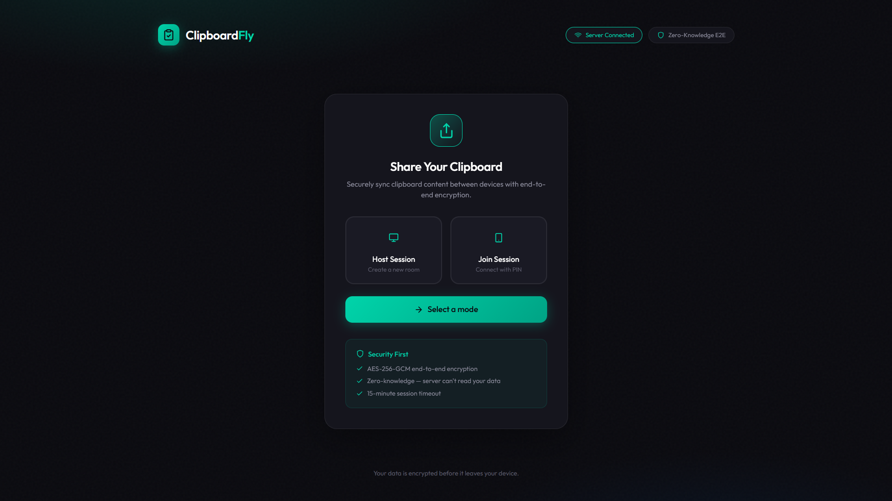

# Clipboard Fly Frontend

Frontend for [Clipboard Fly](https://github.com/yourusername/clipboard-fly-server).



## Configuration

Update the WebSocket URL in `public/index.html` to point to your backend:

```javascript
const WS_SERVER_URL = 'wss://your-backend-url.com';
```